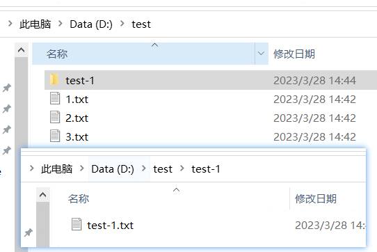

## 关于yaml中路径问题
在yaml中，需要指定文件路径，在window环境下这个时候通常有两种方式
```yaml
app:
  # 工作目录，存放生成的中间文件
#  dataPath: D:\workspace\go_project\skyguard\bigdata\urlcat-security\tmp\test  # 合法
#  dataPath: D:/workspace/go_project/skyguard/bigdata/urlcat-security/tmp/test  # 合法
  # 这种方式在yaml不行，直接报错找不到；这个转义的"\\"写法只在字符串中使用
  dataPath: D:\\workspace\\go_project\\skyguard\\bigdata\\urlcat-security\\tmp\\test\\sophos # 报错
```


## filepath.Walk基本使用
我们的测试目录结构如下：



通过filepath.Walk函数可以遍历该目录下面的所有文件夹和文件，我们通过程序演示一下
```go
func walk(fp string) {
	filepath.Walk(fp, func(path string, info os.FileInfo, err error) error {
		fmt.Println(path)
		return nil
	})
}

func main() {
	var fp = "D:\\test"
	walk(fp)

	fmt.Println("-----------------------------------------------")
	fp = "D:/test"
	walk(fp)
}
```

输出：

```shell
===windows下运行的结果===
D:\test
D:\test\1.txt                                  
D:\test\2.txt                                  
D:\test\3.txt                                  
D:\test\test-1                                 
D:\test\test-1\test-1.txt                      
-----------------------------------------------
D:/test                                        
D:\test\1.txt                                  
D:\test\2.txt                                  
D:\test\3.txt                                  
D:\test\test-1                                 
D:\test\test-1\test-1.txt      

===Linux下运行的结果===
D:\test
-----------------------------------------------
D:/test  
D:/test/1.txt                                  
D:/test/2.txt                                  
D:/test/3.txt                                  
D:/test/test-1                                 
D:/test/test-1/test-1.txt   
```

注意： 
* 在windows平台 walk 的path返回路径为"\\"
* linux平台 walk 的path返回的路径是"/"
* 在linux平台 walk 识别不了"\\"
* 当路径中包含"/" 或 "\\", Walk第一次返回的路径就带 "/" 或 "\\"

