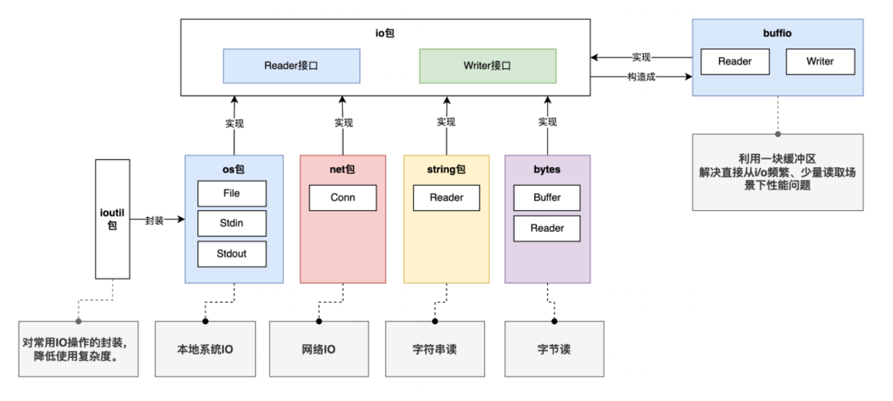

参考资料：https://mp.weixin.qq.com/s/s4y7xOkEJnC0EcOOS_ycsw

今天在知乎上看到这样一个问题：Golang的IO库那么多，我该怎么选。今天就跟大家聊聊这个问题。

首先，我们要知道，golang中有哪些IO包。我整理了一下，大概有io包、bufio包、ioutil、os、net等。

其次，要知道这些io包的各自的定位。我整理了一张图供大家参考：

我们大致讲解下上图：
* io：基础的IO库，提供了Reader和Writer接口。其中的os包、net包、string包、bytes包以及bufio包都实现了io中的Reader或Writer接口。
* os：提供了访问底层操作系统资源的能力，如文件读写、进程控制等。
* net：提供了网络相关的IO功能，如TCP、UDP通信、HTTP请求等。
* string.Reader：提供了string的读取。因为string不能写，所以只有Reader。
* bytes.Buffer和Reader：提供了对字节内容的读写。
* bufio：提供带缓存的I/O操作，解决频繁、少量读取场景下的性能问题。这里利用了计算机的局部性原理。
* ioutil：提供了一些方便的文件读写函数，如ReadFile和WriteFile。

所以，选择哪个库主要取决于你要进行什么样的操作。如果只是简单的文件读写，可以使用ioutil库；如果需要处理大量数据，则应该选择bufio库；如果需要访问底层操作系统功能，则可以使用os库；如果涉及到网络通信，则选择net库。