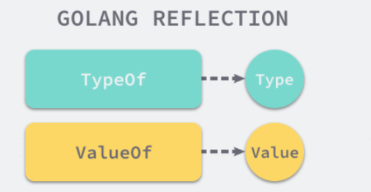
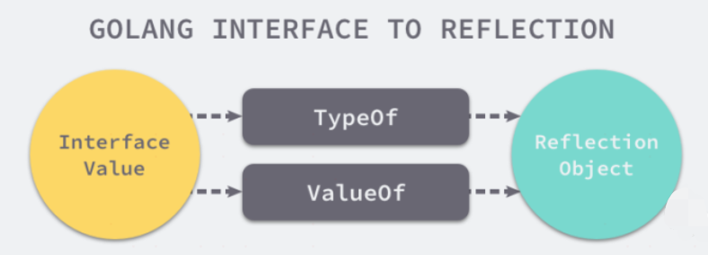
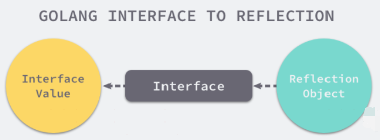
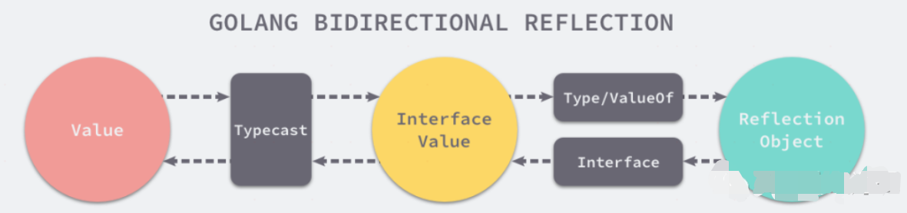

反射是指在程序运行期间对程序本身进行访问和修改的能力。程序在编译时，变量被转换为内存地址，变量名不会被编译器写入到可执行部分。在运行程序时，程序无法获取自身的信息。
支持反射的语言可以在程序编译期间将变量的反射信息，如字段名称、类型信息、结构体信息等整合到可执行文件中，并给程序提供接口访问反射信息，这样就可以在程序运行期间获取类型的反射信息，并且有能力修改它们。
Go程序在运行期间使用reflect包访问程序的反射信息。

在反射中关于类型还划分为两种：类型（Type）和种类（Kind）。因为在Go语言中我们可以使用type关键字构造很多自定义类型，而种类（Kind）就是指底层的类型，但在反射中，当需要区分指针、结构体等大品种的类型时，就会用到种类（Kind）。


## 反射基本使用和应用场景
参考资料：
> https://mp.weixin.qq.com/s/0FNClBKYzgheMiAwjOnKyA
> 
> https://mp.weixin.qq.com/s?__biz=MzU5NTAzNjc3Mg==&mid=2247483962&idx=1&sn=e13df5c5e016215302205f5ec8fbb857&scene=21#wechat_redirect

这个案例用来介绍反射的基本使用场景

现在让我们理解一下 ”在运行时知道变量的类型的必要“。假设我们要编写一个简单的函数，它将一个结构体作为参数，并使用这个参数创建一个SQL插入语句。


## 概述
在具体介绍反射包的实现原理之前，我们先要对 Go 语言的反射有一些比较简单的理解，首先 reflect 中有两对非常重要的函数和类型，我们在上面已经介绍过其中的两个函数 TypeOf 和 ValueOf，另外两个类型是 Type 和 Value，它们与函数是一一对应的关系：



类型 Type 是 Golang 反射包中定义的一个接口，我们可以使用 TypeOf 函数获取任意值的变量的的类型，我们能从这个接口中看到非常多有趣的方法，MethodByName 可以获取当前类型对应方法的引用、Implements 可以判断当前类型是否实现了某个接口：

```go
type Type interface {
        Align() int
        FieldAlign() int
        Method(int) Method
        MethodByName(string) (Method, bool)
        NumMethod() int
        Name() string
        PkgPath() string
        Size() uintptr
        String() string
        Kind() Kind
        Implements(u Type) bool
        ...
}
```

反射包中 Value 的类型却与 Type 不同，Type 是一个接口类型，但是 Value 在 reflect 包中的定义是一个结构体，这个结构体没有任何对外暴露的成员变量，但是却提供了很多方法让我们获取或者写入 Value 结构体中存储的数据：

```go
type Value struct {
        // contains filtered or unexported fields
}

func (v Value) Addr() Value
func (v Value) Bool() bool
func (v Value) Bytes() []byte
func (v Value) Float() float64
...
```

反射包中的所有方法基本都是围绕着 Type 和 Value 这两个对外暴露的类型设计的，我们通过 TypeOf、ValueOf 方法就可以将一个普通的变量转换成『反射』包中提供的 Type 和 Value，使用反射提供的方法对这些类型进行复杂的操作。


## 反射法则
运行时反射是程序在运行期间检查其自身结构的一种方式，它是 元编程 的一种，但是它带来的灵活性也是一把双刃剑，过量的使用反射会使我们的程序逻辑变得难以理解并且运行缓慢，我们在这一节中就会介绍 Go 语言反射的三大法则，这能够帮助我们更好地理解反射的作用。

1. 从接口值可反射出反射对象；
2. 从反射对象可反射出接口值；
3. 要修改反射对象，其值必须可设置；

### 第一法则
反射的第一条法则就是，我们能够将 Go 语言中的接口类型变量(注意我们更多的时候是应用在接口类型变量上面，因为应用到非接口类型变量好像意义不大)转换成反射对象，上面提到的reflect.TypeOf 和 reflect.ValueOf 就是完成这个转换的两个最重要方法，如果我们认为 Go 语言中的类型和反射类型是两个不同『世界』的话，那么这两个方法就是连接这两个世界的桥梁。



我们通过以下例子简单介绍这两个方法的作用，其中 TypeOf 获取了变量 author 的类型也就是 string 而 ValueOf 获取了变量的值 draven，如果我们知道了一个变量的类型和值，那么也就意味着我们知道了关于这个变量的全部信息。
```go
package main

import (
    "fmt"
    "reflect"
)

func main() {
    author := "draven"
    fmt.Println("TypeOf author:", reflect.TypeOf(author))
    fmt.Println("ValueOf author:", reflect.ValueOf(author))
}

$ go run main.go
TypeOf author: string
ValueOf author: draven
```
从变量的类型上我们可以获当前类型能够执行的方法 Method 以及当前类型实现的接口等信息；

* 对于结构体，可以获取字段的数量并通过下标和字段名获取字段 StructField；
* 对于哈希表，可以获取哈希表的 Key 类型；
* 对于函数或方法，可以获得入参和返回值的类型；
* ...

总而言之，使用 TypeOf 和 ValueOf 能够将 Go 语言中的变量转换成反射对象，在这时我们能够获得几乎一切跟当前类型相关数据和操作，然后就可以用这些运行时获取的结构动态的执行一些方法。

> 很多读者可能都会对这个副标题产生困惑，为什么是从接口到反射对象，如果直接调用 reflect.ValueOf(1)，看起来是从基本类型 int 到反射类型，但是 TypeOf 和 ValueOf 两个方法的入参其实是 interface{} 类型。
> 
> 我们在之前已经在 函数调用 一节中介绍过，Go 语言的函数调用都是值传递的，变量会在方法调用前进行类型转换，也就是 int 类型的基本变量会被转换成 interface{} 类型，这也就是第一条法则介绍的是从接口到反射对象。


### 第二法则
我们既然能够将接口类型的变量转换成反射对象类型，那么也需要一些其他方法将反射对象还原成成接口类型的变量，reflect 中的 Interface 方法就能完成这项工作：



然而调用 Interface 方法我们也只能获得 interface{} 类型的接口变量，如果想要将其还原成原本的类型还需要经过一次强制的类型转换，如下所示：
```go
v := reflect.ValueOf(1)
v.Interface().(int)
```
这个过程就像从接口值到反射对象的镜面过程一样，从接口值到反射对象需要经过从基本类型到接口类型的类型转换和从接口类型到反射对象类型的转换，反过来的话，所有的反射对象也都需要先转换成接口类型，再通过强制类型转换变成原始类型：



当然不是所有的变量都需要类型转换这一过程，如果本身就是 interface{} 类型的，那么它其实并不需要经过类型转换，对于大多数的变量来说，类型转换这一过程很多时候都是隐式发生的，只有在我们需要将反射对象转换回基本类型时才需要做显示的转换操作。

### 第三法则
Go 语言反射的最后一条法则是与值是否可以被更改相关的，如果我们想要更新一个 reflect.Value，那么它持有的值一定是可以被更新的，假设我们有以下代码：
```go
func main() {
i := 1
v := reflect.ValueOf(i)
v.SetInt(10)
fmt.Println(i)
}

$ go run reflect.go
panic: reflect: reflect.flag.mustBeAssignable using unaddressable value

goroutine 1 [running]:
reflect.flag.mustBeAssignableSlow(0x82, 0x1014c0)
/usr/local/go/src/reflect/value.go:247 +0x180
reflect.flag.mustBeAssignable(...)
/usr/local/go/src/reflect/value.go:234
reflect.Value.SetInt(0x100dc0, 0x414020, 0x82, 0x1840, 0xa, 0x0)
/usr/local/go/src/reflect/value.go:1606 +0x40
main.main()
/tmp/sandbox590309925/prog.go:11 +0xe0
```
运行上述代码时会导致程序 panic 并报出 reflect: reflect.flag.mustBeAssignable using unaddressable value 错误，仔细想一下其实能够发现出错的原因，Go 语言的 函数调用 都是传值的，所以我们得到的反射对象其实跟最开始的变量没有任何关系，没有任何变量持有复制出来的值，所以直接对它修改会导致崩溃。

想要修改原有的变量我们只能通过如下所示的方法，首先通过 reflect.ValueOf 获取变量指针，然后通过 Elem 方法获取指针指向的变量并调用 SetInt 方法更新变量的值：

```go
func main() {
    i := 1
    v := reflect.ValueOf(&i)
    v.Elem().SetInt(10)
    fmt.Println(i)
}

$ go run reflect.go
10
```
这种获取指针对应的 reflect.Value 并通过 Elem 方法迂回的方式就能够获取到可以被设置的变量，这一复杂的过程主要也是因为 Go 语言的函数调用都是值传递的，我们可以将上述代码理解成：
```go
func main() {
    i := 1
    v := &i
    *v = 10
}
```
如果不能直接操作 i 变量修改其持有的值，我们就只能获取 i 变量所在地址并使用 *v 修改所在地址中存储的整数。

## 实现原理
我们在上面的部分已经对 Go 语言中反射的三大法则进行了介绍，对于接口值和反射对象互相转换的操作和过程都有了一定的了解，接下来我们就深入研究反射的实现原理，分析 reflect 包提供的方法是如何获取接口值对应的反射类型和值、判断协议的实现以及方法调用的过程。

### 类型和值


### 更新变量


### 实现协议

### 方法调用

### 参数检查


### 准备参数

### 调用函数

### 处理返回值

## 总结

