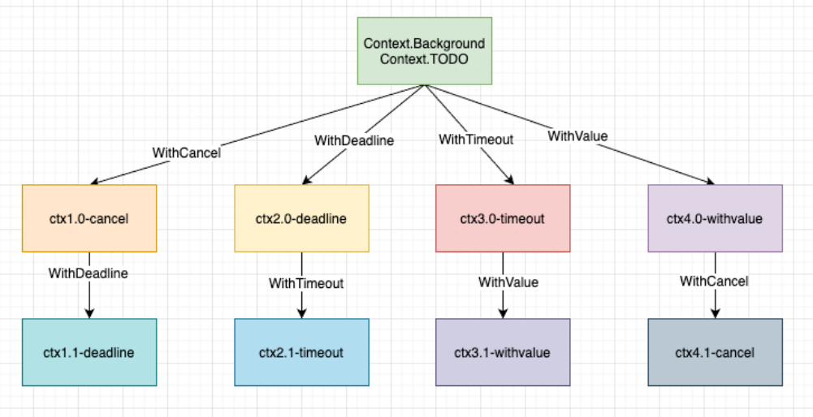
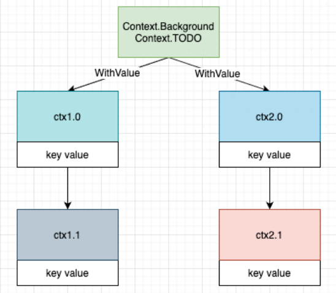

参考资料：
https://segmentfault.com/a/1190000040917752


## 创建context
context包主要提供了两种方式创建context:

* context.Backgroud()
* context.TODO()

这两个函数其实只是互为别名，没有差别。在大多数情况下，我们都使用context.Background作为起始的上下文向下传递。

上面的两种方式是创建根context，不具备任何功能，具体实践还是要依靠context包提供的With系列函数来进行派生：
```go
func WithCancel(parent Context) (ctx Context, cancel CancelFunc)
func WithDeadline(parent Context, deadline time.Time) (Context, CancelFunc)
func WithTimeout(parent Context, timeout time.Duration) (Context, CancelFunc)
func WithValue(parent Context, key, val interface{}) Context
```
这四个函数都要基于父Context衍生，通过这些函数，就创建了一颗Context树，树的每个节点都可以有任意多个子节点，节点层级可以有任意多个，画个图表示一下：



## WithValue携带数据
上面的例子我们获取trace_id是直接从当前ctx获取的，实际我们也可以获取父context中的value，在获取键值对时，我们先从当前context中查找，没有找到会再从父context中查找该键对应的值直到在某个父context中返回 nil 或者查找到对应的值。

context传递的数据中key、value都是interface类型，这种类型编译期无法确定类型，所以不是很安全，所以在类型断言时别忘了保证程序的健壮性。

## 超时控制
通常健壮的程序都是要设置超时时间的，避免因为服务端长时间响应消耗资源，所以一些web框架或rpc框架都会采用withTimeout或者withDeadline来做超时控制，当一次请求到达我们设置的超时时间，就会及时取消，不在往下执行。withTimeout和withDeadline作用是一样的，就是传递的时间参数不同而已，他们都会通过传入的时间来自动取消Context，这里要注意的是他们都会返回一个cancelFunc方法，通过调用这个方法可以达到提前进行取消，不过在使用的过程还是建议在自动取消后也调用cancelFunc去停止减少不必要的资源浪费。

withTimeout、WithDeadline不同在于WithTimeout将持续时间作为参数输入而不是时间对象，这两个方法使用哪个都是一样的，看业务场景和个人习惯了，因为本质withTimout内部也是调用的WithDeadline。


## withCancel取消控制
日常业务开发中我们往往为了完成一个复杂的需求会开多个gouroutine去做一些事情，这就导致我们会在一次请求中开了多个goroutine确无法控制他们，这时我们就可以使用withCancel来衍生一个context传递到不同的goroutine中，当我想让这些goroutine停止运行，就可以调用cancel来进行取消。


## 源码赏析
Context其实就是一个接口，定义了四个方法：
```go
type Context interface {
 Deadline() (deadline time.Time, ok bool)
 Done() <-chan struct{}
 Err() error
 Value(key interface{}) interface{}
}
```
* Deadlne方法：当Context自动取消或者到了取消时间被取消后返回
* Done方法：当Context被取消或者到了deadline返回一个被关闭的channel
* Err方法：返回context取消的原因
* Value方法：获取设置的key对应的值

### 创建根Context
其在我们调用context.Background、context.TODO时创建的对象就是empty：
```go
var (
    background = new(emptyCtx)
    todo       = new(emptyCtx)
)

func Background() Context {
    return background
}

func TODO() Context {
    return todo
}

```
Background和TODO还是一模一样的，官方说：background它通常由主函数、初始化和测试使用，并作为传入请求的顶级上下文；TODO是当不清楚要使用哪个 Context 或尚不可用时，代码应使用 context.TODO，后续再进行替换掉，归根结底就是语义不同而已。

### WithValue的实现
withValue内部主要就是调用valueCtx类：
```go
func WithValue(parent Context, key, val interface{}) Context {
    if parent == nil {
        panic("cannot create context from nil parent")
    }
    if key == nil {
        panic("nil key")
    }
    if !reflectlite.TypeOf(key).Comparable() {
        panic("key is not comparable")
    }
    return &valueCtx{parent, key, val}
}
```
### valueCtx类
valueCtx目的就是为Context携带键值对，因为它采用嵌入接口的实现方式，他会继承父Context，也就相当于嵌入Context当中了

实现Value方法来存储键值对：
```go
func (c *valueCtx) Value(key interface{}) interface{} {
    if c.key == key {
        return c.val
    }
    return c.Context.Value(key)
}
```
看图来理解一下：



所以我们在调用Context中的Value方法时会层层向上调用直到最终的根节点，中间要是找到了key就会返回，否会就会找到最终的emptyCtx返回nil。

### WithCancel的实现
我们来看一下WithCancel的入口函数源代码：
```go
func WithCancel(parent Context) (ctx Context, cancel CancelFunc) {
    if parent == nil {
        panic("cannot create context from nil parent")
    }
    c := newCancelCtx(parent)
    propagateCancel(parent, &c)
    return &c, func() { c.cancel(true, Canceled) }
}
```
这个函数执行步骤如下：
* 创建一个cancelCtx对象，作为子context
* 然后调用propagateCancel构建父子context之间的关联关系，这样当父context被取消时，子context也会被取消。
* 返回子context对象和子树取消函

## 如何使用 context

### 传递共享的数据

### 取消 goroutine
我们先来设想一个场景：打开外卖的订单页，地图上显示外卖小哥的位置，而且是每秒更新 1 次。app 端向后台发起 websocket 连接（现实中可能是轮询）请求后，后台启动一个协程，每隔 1 秒计算 1 次小哥的位置，并发送给端。如果用户退出此页面，则后台需要“取消”此过程，退出 goroutine，系统回收资源。
```go
func Perform(ctx context.Context) {
    for {
        calculatePos()
        sendResult()

        select {
        case <-ctx.Done():
            // 被取消，直接返回
            return
        case <-time.After(time.Second):
            // block 1 秒钟 
        }
    }
}
```
主流程可能是这样的：
```go
ctx, cancel := context.WithTimeout(context.Background(), time.Hour)
go Perform(ctx)

// ……
// app 端返回页面，调用cancel 函数
cancel()
```
注意一个细节，WithTimeOut 函数返回的 context 和 cancelFun 是分开的。context 本身并没有取消函数，这样做的原因是取消函数只能由外层函数调用，防止子节点 context 调用取消函数，从而严格控制信息的流向：由父节点 context 流向子节点 context。

### 防止 goroutine 泄漏
这里改编一个“如果不用 context 取消，goroutine 就会泄漏的例子”
```go
func gen() <-chan int {
	ch := make(chan int)
	go func() {
		var n int
		for {
			ch <- n
			n++
			time.Sleep(time.Second)
		}
	}()
	return ch
}
```
这是一个可以生成无限整数的协程，但如果我只需要它产生的前 5 个数，那么就会发生 goroutine 泄漏：
```go
func main() {
	for n := range gen() {
		fmt.Println(n)
		if n == 5 {
			break
		}
	}
	// ……
}
```
当 n == 5 的时候，直接 break 掉。那么 gen 函数的协程就会执行无限循环，永远不会停下来。发生了 goroutine 泄漏。

用 context 改进这个例子：
```go
func gen(ctx context.Context) <-chan int {
	ch := make(chan int)
	go func() {
		var n int
		for {
			select {
			case <-ctx.Done():
				return
			case ch <- n:
				n++
				time.Sleep(time.Second)
			}
		}
	}()
	return ch
}

func main() {
	ctx, cancel := context.WithCancel(context.Background())
	defer cancel() // 避免其他地方忘记 cancel，且重复调用不影响

	for n := range gen(ctx) {
		fmt.Println(n)
		if n == 5 {
			cancel()
			break
		}
	}
	// ……
}
```


## 鸟窝笔记
### WithCancel
```go

func WithCancel(parent Context) (ctx Context, cancel CancelFunc) {
    c := newCancelCtx(parent)
    propagateCancel(parent, &c)// 把c朝上传播
    return &c, func() { c.cancel(true, Canceled) }
}

// newCancelCtx returns an initialized cancelCtx.
func newCancelCtx(parent Context) cancelCtx {
    return cancelCtx{Context: parent}
}
```
当这个 cancelCtx 的 cancel 函数被调用的时候，或者 parent 的 Done 被 close 的时候，这个 cancelCtx 的 Done 才会被 close。

cancelCtx 被取消时，它的 Err 字段就是下面这个 Canceled 错误：
```go
var Canceled = errors.New("context canceled")
```

### WithTimeout
WithTimeout 其实是和 WithDeadline 一样，只不过一个参数是超时时间，一个参数是截止时间。超时时间加上当前时间，其实就是截止时间，因此，WithTimeout 的实现是：
```go
func WithTimeout(parent Context, timeout time.Duration) (Context, CancelFunc) {
    // 当前时间+timeout就是deadline
    return WithDeadline(parent, time.Now().Add(timeout))
}
```

### WithDeadline
如果它的截止时间晚于 parent 的截止时间，那么就以 parent 的截止时间为准，并返回一个类型为 cancelCtx 的 Context，因为 parent 的截止时间到了，就会取消这个 cancelCtx。

如果当前时间已经超过了截止时间，就直接返回一个已经被 cancel 的 timerCtx。否则就会启动一个定时器，到截止时间取消这个 timerCtx。

综合起来，timerCtx 的 Done 被 Close 掉，主要是由下面的某个事件触发的：
* 截止时间到了；
* cancel 函数被调用；
* parent 的 Done 被 close。

### 总结
我们经常使用 Context 来取消一个 goroutine 的运行，这是 Context 最常用的场景之一，Context 也被称为 goroutine 生命周期范围（goroutine-scoped）的 Context，把 Context 传递给 goroutine。但是，goroutine 需要尝试检查 Context 的 Done 是否关闭了：
