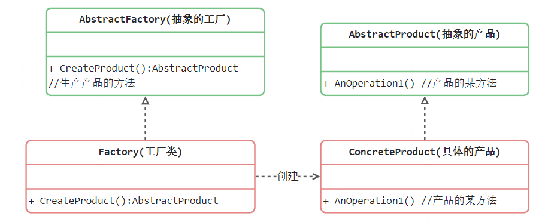
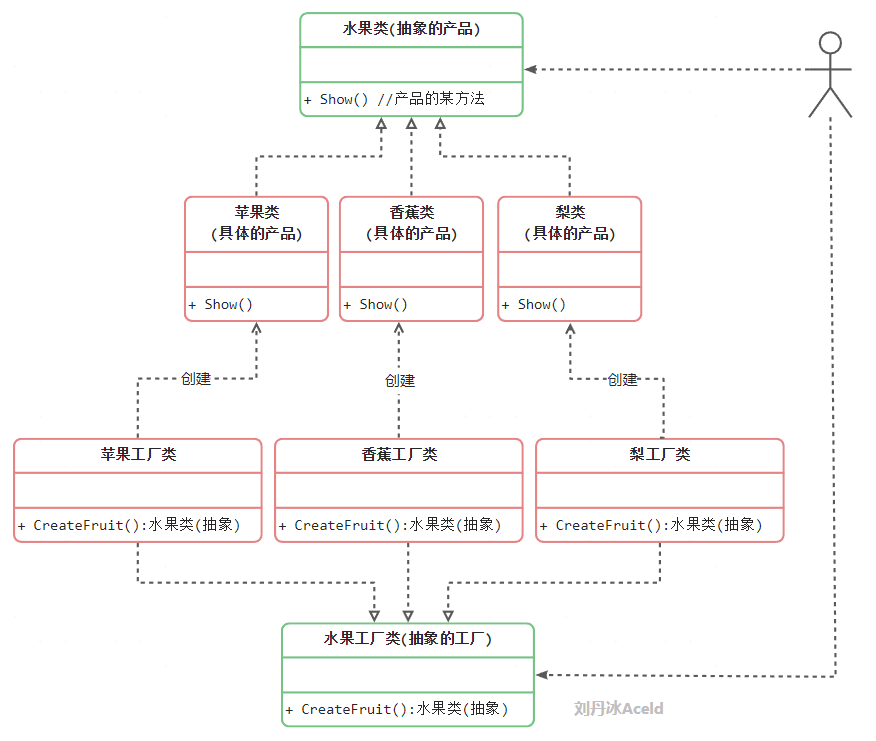

## 工厂方法模式中的角色和职责

* 抽象工厂（Abstract Factory）角色：工厂方法模式的核心，任何工厂类都必须实现这个接口。
* 工厂（Concrete Factory）角色：具体工厂类是抽象工厂的一个实现，负责实例化产品对象。
* 抽象产品（Abstract Product）角色：工厂方法模式所创建的所有对象的父类，它负责描述所有实例所共有的公共接口。
* 具体产品（Concrete Product）角色：工厂方法模式所创建的具体实例对象。

简单工厂模式  + “开闭原则” =    工厂方法模式

## 工厂方法模式的实现

