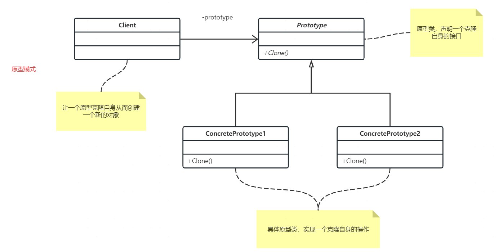

## 定义

UML图里的Client是客户端，可以不用管。对于Prototype，核心在于对象自身的Clone函数，用于拷贝自己。所以对于原型模式主要关注Clone函数即可，Clone可实现深拷贝或者浅拷贝。

至于是否需要有Prototype接口类，看具体情况，如果需要用到里氏替换，就创建接口类，如果没有用处，就无需创建。

## 使用场景
原型模式主要用于创建对象成本较大的情况。如果创建对象极其方便，就不要用原型模式了，否则有过度设计、得不偿失之嫌。

一般使用在建立对象特别耗费资源，如需要从DB、硬盘等获取大量数据或者需要经过大量计算等；又或者建立的对象存储的内容是可以被复用，完全重新建一个新的更加耗时。

## 总结
原型模式就是利用对已有对象（原型）进行复制（或者叫拷贝）的方式，来创建新对象，以达到节省创建时间的目的。拷贝可以选择深拷贝或者浅拷贝。

