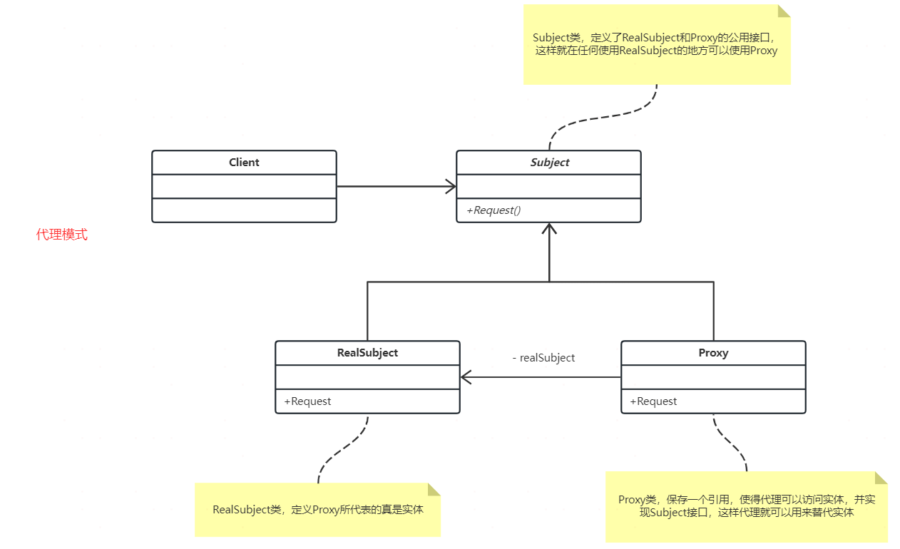

## 定义

代理模式能够在不改变原始类（或叫被代理类）代码的情况下，通过引入代理类来给原始类附加功能。

看UML类图，可以看出代理类Proxy和被代理类RealSubject实现了相同接口Subject，代理类包含被代理类的引用。代理模式实现了在被代理类外面套了一层壳。虽然整体的设计和思想都很简单，但效果却很明显。首先在请求RealSubject的时候，必须经过Proxy，这样一些前置或者后置通用操作都可以放在Proxy中，扩展性和通用性都会加强。其次，因为Proxy和RealSubject各自实现了一部分功能，会使RealSubject更加关注自己的业务逻辑，起到很好的隔离效果。

## 使用场景
使用代理模式的场景有以下这些：

* 业务系统的非功能性需求开发：如监控、统计、鉴权、限流、事务、幂等、日志等，这些和业务没有关系，所以可以放到Proxy中，RealSubject只关注功能性需求。 以前写过一篇文章如何高效对接第三方支付，公司对接了大量的第三方支付公司（PayU、PayTM、WX），这些公司发起支付的流程是一样的，核心是获取token，但是还要做很多琐碎、通用的工作，如校验签名、初始化订单数据、参数检查、记录日志等。这些琐碎功能如果让每一个支付类自己处理，不但是重复开发，而且后期修改时不易维护，这时候就很适合用代理模式。
* 框架设计，如RPC的实现。调用RPC客户端，客户端会自动调用RPC服务端，客户端也是一个代理，做了大量操作让开发者可以不关心是如何成功调用到服务端的，只需要关心逻辑实现即可。

## 代码实现

## 总结
代理模式简单实用，使用得当能让系统可扩展性增强。它能帮助开发者实现具体业务和通用逻辑的分离，是开发者只需关注具体业务，满足开放-封闭、里氏替换、依赖倒转等原则。
