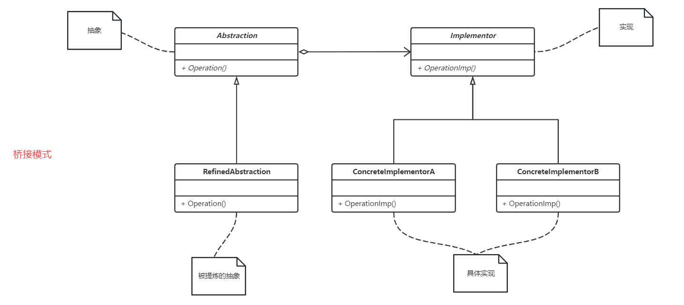

## 定义

桥接模式并不常用，而且桥接模式的概念比较抽象。桥接模式一般用于有多种分类的情况，如果实现系统可能有多角度分类，每一种分类都有可能变化，那么就把这种多角度分离出来让他们独立变化，减少他们之间的耦合。

将抽象部分与它的实现部分分离，使他们都可以独立地变化。

## 使用场景
在发现我们需要多角度去分类实现对象，而只用继承会造成大量的类增加，不能满足开放-封闭原则时，就应该要考虑用桥接模式了。

以前工作的时候，用户触达方式支持SMS、Email、AppPush、站内信，但这些方式没有系统化，散乱在各个代码中。后来要做用户旅程，本来想趁着这个时机将这些触达方式系统化，但后来因为各种原因没有成行。正好趁着这个计划，写个简单版的触达系统。

## 代码实现

## 总结
桥接模式符合了开放-封闭原则、里氏替换原则、依赖倒转原则。使用桥接模式，一定要看一下场景中是否有多种分类、且分类之间有一定关联。如果符合的话，建议用桥接模式，这样不同分类可以独立变化，相互之间不影响。
