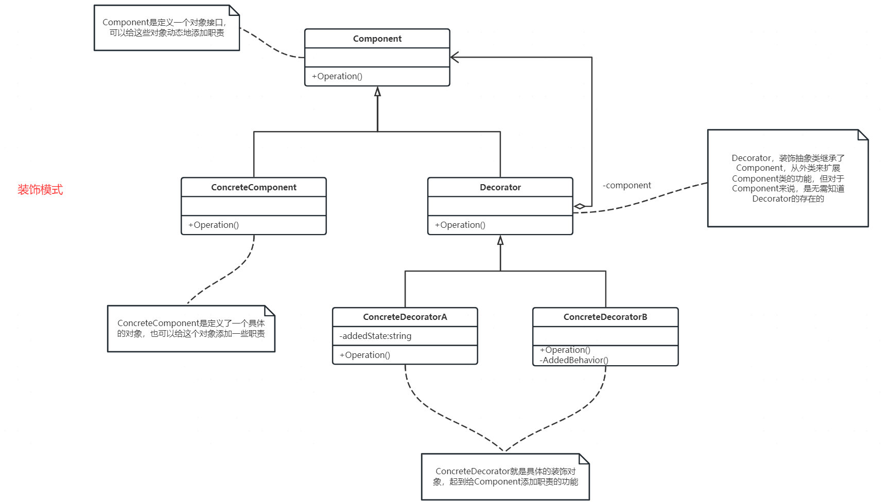

## 定义

装饰器模式主要解决继承关系过于复杂的问题，通过组合来替代继承。它主要的作用是给原始类添加增强功能。 装饰器类和原始类继承同一个父类，这么看感觉和代理模式一样。但其实两者作用不同，装饰器模式主要用于增加功能，代理模式主要用于附加跟原始类无关的功能。

首先我们需要理解，为什么组合优于继承？
* 继承有诸多作用，但继承层次过深、过复杂，会影响到代码的可维护性。
* 继承主要有三个作用：表示is-a关系，支持多态特性，代码复用。而这三个作用都可以通过组合、接口、委托三个技术手段来达成。除此之外，利用组合还能解决层次过深、过复杂的继承关系影响代码可维护性的问题。

再来看一下装饰器模式和代理模式的区别。

## 使用场景
装饰器模式一般用在基类功能封装不错，但使用的时候需要对功能进行一些加强，而这些加强版的功能也会被其它加强版需要，这种就比较适合。

尼古拉斯凯奇主演的《战争之王》不知道大家看过没有。记得里面有个场景，凯奇买了一架武装直升机，这时FBI带人抓捕，凯奇将直升机和导弹分开就合法了。直升机就是那个封装特别好的类，能够长距离飞行。想用武装直升机，就在上面加导弹。想用救援直升机就在上面加医生。想用武装救援直升机，就在上面即加导弹又加医生。

我们就按照这个例子写代码吧。

## 代码实现

## 总结
装饰器模式相对于简单的组合关系，还有两个比较特殊的地方。

第一个比较特殊的地方是：装饰器类和原始类继承同样的父类，这样我们可以对原始类“嵌套”多个装饰器类。 比如飞行器这个接口，装饰器类(武装、救援)和原始类(直升机)都实现了这个接口，那么我们就可以对原始类进行多次装饰

第二个比较特殊的地方是：装饰器类是对功能的增强，这也是装饰器模式应用场景的一个重要特点。 实际上，符合“组合关系”这种代码结构的设计模式有很多，比如之前讲过的代理模式、桥接模式，还有现在的装饰器模式。
尽管它们的代码结构很相似，但是每种设计模式的意图是不同的。 就拿比较相似的代理模式和装饰器模式来说吧，代理模式中，代理类附加的是跟原始类无关的功能，而在装饰器模式中，装饰器类附加的是跟原始类相关的增强功能。
