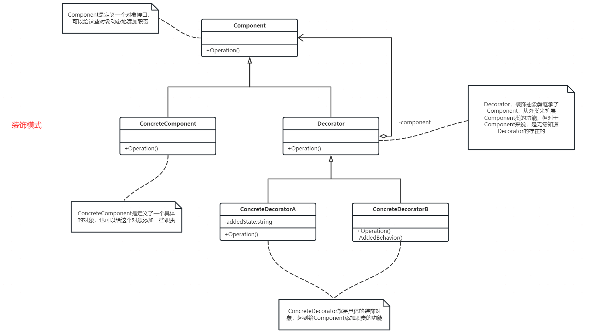

## 定义

装饰器模式主要解决继承关系过于复杂的问题，通过组合来替代继承。它主要的作用是给原始类添加增强功能。 装饰器类和原始类继承同一个父类，这么看感觉和代理模式一样。但其实两者作用不同，装饰器模式主要用于增加功能，代理模式主要用于附加跟原始类无关的功能。

首先我们需要理解，为什么组合优于继承？
* 继承有诸多作用，但继承层次过深、过复杂，会影响到代码的可维护性。
* 继承主要有三个作用：表示is-a关系，支持多态特性，代码复用。而这三个作用都可以通过组合、接口、委托三个技术手段来达成。除此之外，利用组合还能解决层次过深、过复杂的继承关系影响代码可维护性的问题。

再来看一下装饰器模式和代理模式的区别。

## 使用场景
装饰器模式一般用在基类功能封装不错，但使用的时候需要对功能进行一些加强，而这些加强版的功能也会被其它加强版需要，这种就比较适合。

尼古拉斯凯奇主演的《战争之王》不知道大家看过没有。记得里面有个场景，凯奇买了一架武装直升机，这时FBI带人抓捕，凯奇将直升机和导弹分开就合法了。直升机就是那个封装特别好的类，能够长距离飞行。想用武装直升机，就在上面加导弹。想用救援直升机就在上面加医生。想用武装救援直升机，就在上面即加导弹又加医生。

我们就按照这个例子写代码吧。

## 代码实现

## 总结

