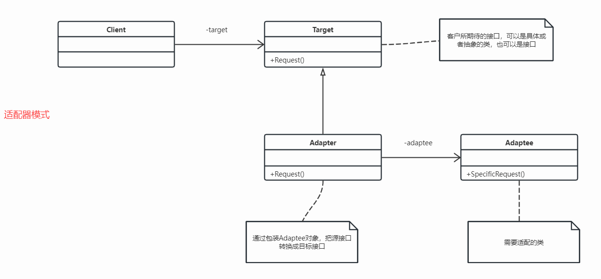

## 定义
配器模式比较简单，也比较容易理解。适配器模式可以看作一种“补偿模式”，用来补救设计上的缺陷。应用这种模式算是“无奈之举”。

适配器模式：将一个类的接口转换成客户希望的另外一个接口。Adapter模式使得原本由于接口不兼容而不能一起工作的那些类可以一起工作。

通过UML图看到Adapter和Adaptee是关联关系，但Adapter和Adaptee也可以是继承关系，这种情况一般用于Adaptee大部分成员函数已经和Target一致，只有少部分需要修改，使用继承能够减少代码改动。如果Adaptee大部分成员函数和Target不一致，最好还是用组合，毕竟组合优于继承。当然对Go而言就无所谓了，反正只有组合没有继承，而且匿名组合能够直接复用组合对象的功能。

## 使用场景
遇到如下几种场景的时候可以考虑使用适配器模式：

* 封装有缺陷的接口设计：例如如果引入的外部系统接口设计方面有缺陷，会影响我们自身代码的可测性等，就可以考虑使用适配器模式，将引入的系统向我们自身系统设计上靠拢
* 统一多个类的接口设计：如果一个功能依赖多个外部系统，且这些外部系统的能力是相似的但接口不统一，可以使用适配器模式，依赖于继承、多态的特性，使调用方可以以聚合方式使用外部系统，提升代码扩展性
* 替换依赖的外部系统：如果一个功能有多个外部系统可供选择，我们可以定义一个Target接口，将外部系统适配为Target，这样就能利用多态性，实现外部系统的替换
* 兼容老版本接口：老版本中功能A在新版本中被废弃，A将由B替代，为了不影响使用者，新版本中仍然会有A，但是其内部实现委托B执行
* 适配不同格式的数据：有时数据来源不同，数据格式也不同，需要对数据做适配，改为统一格式后再处理，也可使用适配器模式

### 数据适配案例
我在项目中用适配器模式，主要处理数据适配。以前做支付网关的时候，每个第三方返回的数据都不一致，为了符合支付系统定义的格式，必须进行适配。这种地方特别多，就选对账功能这块讲一下，其它关于支付的内容可以参考这篇文章如何高效对接第三方支付。

### 电压适配案例

## 代码实现
所谓对账，是指从第三方支付公司拉取指定时间内的支付单信息，与系统内部支付单信息做对比，主要用来发现支付异常
1. 支付网关有数据，第三方没有数据

   * 可能被黑客攻击了，用户没有真正支付，但是我们发货了
   * 代码有问题，用户没有完成支付，但是系统认为支付成功了
   * 第三方提供数据不全

2. 支付网关没有数据，第三方有数据

   * 用户支付成功，但是同步或者异步通知都失败了

3. 金额不一致

   * 代码有问题，电商发起支付金额和真正调用第三方金额不一致
   * 第三方提供数据有问题

做对比的逻辑是一致的，但是第三方支付账单数据格式不一致，所以需要先将这些数据转化为标准格式。

## 总结

