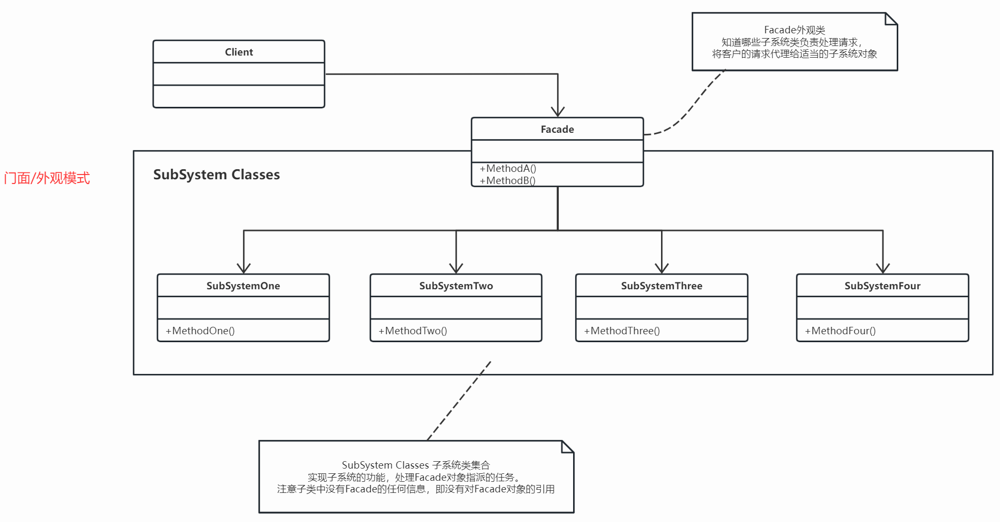

## 定义
门面模式：为子系统中的一组接口提供一个一致的界面，此模式定义了一个高层接口，这个接口使得这一子系统更加容易使用。

门面模式没有太多好分析的，思想比较简单。我方系统中包含多个子系统，完成一项任务需要多个子系统通力合作。

我们可以选择将子系统所有接口暴露给Client，让Client自行调用。但这会导致一些问题，一是后期沟通成本会很高，加入完成一个功能需要调用多个接口，Client联调时出问题率会飙升，系统提供者需要不断答疑。二是如果有多个Client，相同代码Client需要重复开发，而且后期代码有变更，各方都会很烦费力。三是影响响应时间和性能，多个接口往返，白白增加了很多通信时间和请求量。

另一种方式是，对于指定功能，系统端做好封装，只提供一个接口。好处有很多，沟通成本低、Client不需要重复开发、功能更改影响范围小、提高响应时间和性能。一般这些接口会有对应的OpenAPI，实现了功能对外开放的效果。

## 使用场景

## 代码实现

## 总结

