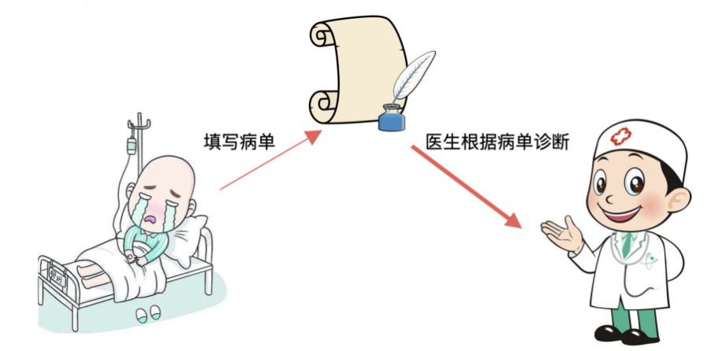
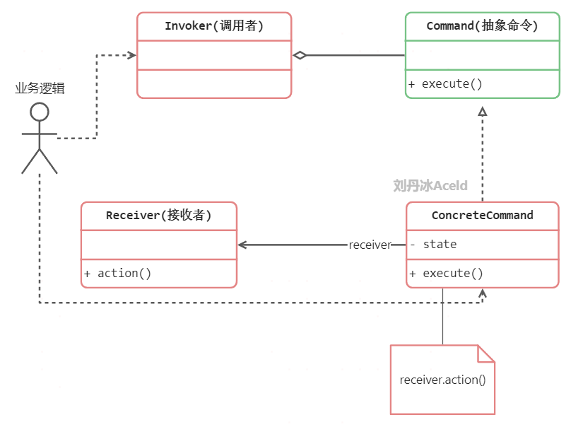
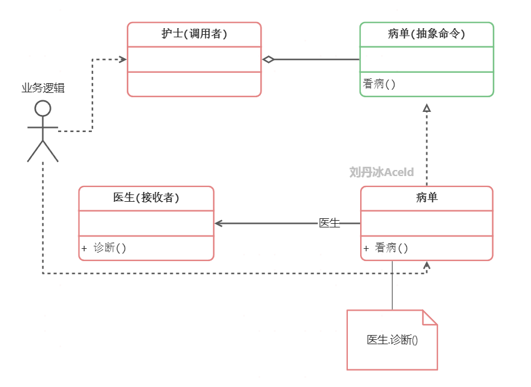

## 定义


## 使用场景


## 代码实现

## 总结

# 刘丹冰
下面来看一种场景，如果去医院看病，病人作为业务方用户，直接找医生看病，这样的场景如下：


那么实现这个模块依赖流程的代码如下：
```go
package main

import "fmt"

type Doctor struct {}

func (d *Doctor) treatEye() {
	fmt.Println("医生治疗眼睛")
}

func (d *Doctor) treatNose() {
	fmt.Println("医生治疗鼻子")
}


//病人
func main() {
	doctor := new(Doctor)
	doctor.treatEye()
	doctor.treatNose()
}
```

这样Doctor作为核心的消息接受者和计算模块，将和业务模块高耦合，每个业务方都需要直接面向Doctor依赖和编程。

那么可以通过下述方式，新增一个订单模块，将业务方和核心医生模块进行解耦和隔离。



病人可以先填写病单，并不会直接和医生进行交互和耦合，医生只对接订单的接口，实现的代码方式如下：
```go
package main

import "fmt"

type Doctor struct {}

func (d *Doctor) treatEye() {
	fmt.Println("医生治疗眼睛")
}

func (d *Doctor) treatNose() {
	fmt.Println("医生治疗鼻子")
}

//治疗眼睛的病单
type CommandTreatEye struct {
	doctor *Doctor
}

func (cmd *CommandTreatEye) Treat() {
	cmd.doctor.treatEye()
}

//治疗鼻子的病单
type CommandTreatNose struct {
	doctor *Doctor
}

func (cmd *CommandTreatNose) Treat() {
	cmd.doctor.treatNose()
}


//病人
func main() {
	//依赖病单，通过填写病单，让医生看病
	//治疗眼睛的病单
	doctor := new(Doctor)
	cmdEye := CommandTreatEye{doctor}
	cmdEye.Treat() //通过病单来让医生看病

	cmdNose := CommandTreatNose{doctor}
	cmdNose.Treat() //通过病单来让医生看病
}
```

这样就通过病单将医生（核心计算）和病人（业务）解耦，但是随着病单种类的繁多，病人（业务）依然需要了解各个订单的业务，所以应该将病单抽象出来变成一个interface，然后再新增一个管理病单集合的模块，这个按理来讲就是一名医护人员。

命令模式的标准的类图如下：



## 命令模式中的的代码实现

结合本章的例子，可以得到类图如下：



代码实现如下：
```go
package main

import "fmt"

//医生-命令接收者
type Doctor struct {}

func (d *Doctor) treatEye() {
	fmt.Println("医生治疗眼睛")
}

func (d *Doctor) treatNose() {
	fmt.Println("医生治疗鼻子")
}


//抽象的命令
type Command interface {
	Treat()
}

//治疗眼睛的病单
type CommandTreatEye struct {
	doctor *Doctor
}

func (cmd *CommandTreatEye) Treat() {
	cmd.doctor.treatEye()
}

//治疗鼻子的病单
type CommandTreatNose struct {
	doctor *Doctor
}

func (cmd *CommandTreatNose) Treat() {
	cmd.doctor.treatNose()
}


//护士-调用命令者
type Nurse struct {
	CmdList []Command //收集的命令集合
}

//发送病单，发送命令的方法
func (n *Nurse) Notify() {
	if n.CmdList == nil {
		return
	}

	for _, cmd := range n.CmdList {
		cmd.Treat()	//执行病单绑定的命令(这里会调用病单已经绑定的医生的诊断方法)
	}
}

//病人
func main() {
	//依赖病单，通过填写病单，让医生看病
	doctor := new(Doctor)
	//治疗眼睛的病单
	cmdEye := CommandTreatEye{doctor}
	//治疗鼻子的病单
	cmdNose := CommandTreatNose{doctor}

	//护士
	nurse := new(Nurse)
	//收集管理病单
	nurse.CmdList = append(nurse.CmdList, &cmdEye)
	nurse.CmdList = append(nurse.CmdList, &cmdNose)

	//执行病单指令
	nurse.Notify()
}
```

