```go
for i := 0; i < 4; i++ {
        go func() {
                time.Sleep(time.Second)
        }()
}
fmt.Println(runtime.NumGoroutine())
```
上面这段代码的输出为：5。说明当前这个应用程序中存在 goroutine 的数量是 5，事实上也符合我们的预期。那么问题来了，这 5 个 goroutine 作为操作系统用户态的基本调度单元是无法直接占用操作系统的资源来执行的，必须经过内核级线程的分发，这是操作系统内部线程调度的基本模型，根据用户级线程和内核级线程的对应关系可以分为 1 对 1，N 对 1 以及 M 对 N 这三种模型，那么上述的 5 个 goroutine 在内核级线程上是怎么被分发的，这就是 Go语言的 goroutine 调度器决定的。

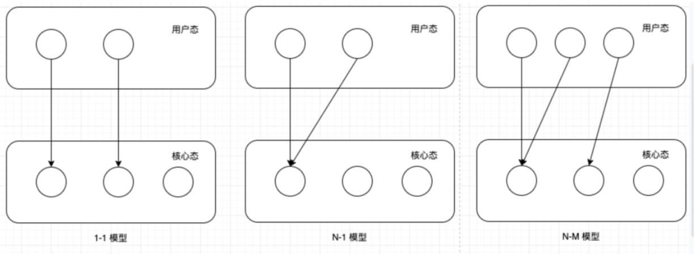

再来看 M，取 machine 的首字母，它代表一个工作线程，或者说系统线程。G 需要调度到 M 上才能运行，M 是真正工作的人。
结构体 m 就是我们常说的 M，它保存了 M 自身使用的栈信息、当前正在 M 上执行的 G 信息、与之绑定的 P 信息……

一个 M 只有绑定 P 才能执行 goroutine，当 M 被阻塞时，整个 P 会被传递给其他 M ，或者说整个 P 被接管。

GPM 三足鼎力，共同成就 Go scheduler。G 需要在 M 上才能运行，M 依赖 P 提供的资源，P 则持有待运行的 G。

工作线程 M 费尽心机也要找到一个可运行的 goroutine，共经历三个过程：先从本地队列找，定期会从全局队列找，最后实在没办法，就去别的 P 偷。


参考资料：《go语言第一课》
因此，一个 Go 程序中可以创建成千上万个并发的 Goroutine。而将这些 Goroutine 按照一定算法放到“CPU”上执行的程序，
就被称为 Goroutine 调度器（Goroutine Scheduler），注意，这里说的“CPU”打了引号。

在操作系统层面，线程竞争的“CPU”资源是真实的物理 CPU，但在 Go 程序层面，各个 Goroutine 要竞争的“CPU”资源又是什么呢？
Go 程序是用户层程序，它本身就是整体运行在一个或多个操作系统线程上的。所以这个答案就出来了：Goroutine 们要竞争的“CPU”资源就是操作系统线程。
这样，Goroutine 调度器的任务也就明确了：将 Goroutine 按照一定算法放到不同的操作系统线程中去执行。

Goroutine 调度器的实现不是一蹴而就的，它的调度模型与算法也是几经演化，
从最初的(Go 1.0)G-M 模型、(Go 1.1 版本中实现了 G-P-M 调度模型和work stealing 算法)到 G-P-M 模型(不支持抢占)，
(Go 1.2 中实现了基于协作的“抢占式”调度)到支持协作式抢占，(Go 1.14增加)再到支持基于信号的异步抢占，Goroutine 调度器经历了不断地优化与打磨。


首先我们来看最初的 G-M 模型。
2012 年 3 月 28 日，Go 1.0 正式发布。在这个版本中，Go 开发团队实现了一个简单的 Goroutine 调度器。在这个调度器中，每个 Goroutine 对应于运行时中的一个抽象结构：G(Goroutine) ，
而被视作“物理 CPU”的操作系统线程，则被抽象为另外一个结构：M(machine)。
调度器的工作就是将 G 调度到 M 上去运行。为了更好地控制程序中活跃的 M 的数量，调度器引入了 GOMAXPROCS 变量来表示 Go 调度器可见的“处理器”的最大数量。

G: 代表 Goroutine，存储了 Goroutine 的执行栈信息、Goroutine 状态以及 Goroutine 的任务函数等，而且 G 对象是可以重用的；
P: 代表逻辑 processor，P 的数量决定了系统内最大可并行的 G 的数量，P 的最大作用还是其拥有的各种 G 对象队列、链表、一些缓存和状态；
M: M 代表着真正的执行计算资源。在绑定有效的P后，进入一个调度循环，而调度循环的机制大致是从P的本地运行队列以及全局队列中获取G，切换到G的执行栈上并执行G的函数，
    调用 goexit 做清理工作并回到 M，如此反复。M 并不保留 G 状态，这是 G 可以跨 M 调度的基础。

Go 程序启动时，运行时会去启动一个名为 sysmon 的 M（一般称为监控线程），这个 M 的特殊之处在于它不需要绑定 P 就可以运行（以 g0 这个 G 的形式）
我们看到，sysmon 每 20us~10ms 启动一次，sysmon 主要完成了这些工作：
    释放闲置超过 5 分钟的 span 内存；
    如果超过 2 分钟没有垃圾回收，强制执行；
    将长时间未处理的 netpoll 结果添加到任务队列；
    向长时间运行的 G 任务发出抢占调度；
    收回因 syscall 长时间阻塞的 P；

从上面的代码中，我们可以看出，如果一个 G 任务运行 10ms，sysmon 就会认为它的运行时间太久而发出抢占式调度的请求。一旦 G 的抢占标志位被设为 true，
那么等到这个 G 下一次调用函数或方法时，运行时就可以将 G 抢占并移出运行状态，放入队列中，等待下一次被调度。

不过，除了这个常规调度之外，还有两个特殊情况下 G 的调度方法。
第一种：channel 阻塞或网络 I/O 情况下的调度。


第二种：系统调用阻塞情况下的调度。


参考资料：https://www.yuque.com/aceld/golang/srxd6d 刘丹冰

一个“用户态线程”必须要绑定一个“内核态线程”，但是CPU并不知道有“用户态线程”的存在，它只知道它运行的是一个“内核态线程”(Linux的PCB进程控制块)。
这样，我们再去细化去分类一下，内核线程依然叫“线程(thread)”，用户线程叫“协程(co-routine)".
看到这里，我们就要开脑洞了，既然一个协程(co-routine)可以绑定一个线程(thread)，那么能不能多个协程(co-routine)绑定一个或者多个线程(thread)上呢。
所以，我们goroutine调度器的目标就是将多个协程以某种合理的方式绑定到多个线程上(由go运行时来调度，不用陷入内核态)，而对应c++这类语言，它需要陷入操作系统，并且由操作系统进行调度

在Go中，线程是运行goroutine的实体，调度器的功能是把可运行的goroutine分配到工作线程上。

Goroutine调度器和OS调度器是通过M结合起来的，每个M都代表了1个内核线程，OS调度器负责把内核线程分配到CPU的核上执行。

### 有关 P 和 M 的个数问题
1、P的数量：
由启动时环境变量$GOMAXPROCS或者是由runtime的方法GOMAXPROCS()决定。这意味着在程序执行的任意时刻都只有$GOMAXPROCS个goroutine在同时运行。

2、M的数量：
go语言本身的限制：go程序启动时，会设置M的最大数量，默认10000.但是内核很难支持这么多的线程数，所以这个限制可以忽略。
runtime/debug中的SetMaxThreads函数，设置M的最大数量
一个M阻塞了，会创建新的M

M与P的数量没有绝对关系，一个M阻塞，P就会去创建或者切换另一个M，所以，即使P的默认数量是1，也有可能会创建很多个M出来。

### P和M何时会被创建
1、P何时创建：在确定了P的最大数量n后，运行时系统会根据这个数量创建n个P。

2、M何时创建：没有足够的M来关联P并运行其中的可运行的G。比如所有的M此时都阻塞住了，而P中还有很多就绪任务，就会去寻找空闲的M，而没有空闲的，就会去创建新的M。

### 调度器的设计策略
复用线程：避免频繁的创建、销毁线程，而是对线程的复用。
1. work stealing机制：当本线程无可运行的G时，尝试从其他线程绑定的P偷取G，而不是销毁线程。
2. hand off机制：当本线程因为G进行系统调用阻塞时，线程释放绑定的P，把P转移给其他空闲的线程执行。

利用并行：GOMAXPROCS设置P的数量，最多有GOMAXPROCS个线程分布在多个CPU上同时运行。
    GOMAXPROCS也限制了并发的程度，比如GOMAXPROCS = 核数/2，则最多利用了一半的CPU核进行并行。

抢占：在coroutine中要等待一个协程主动让出CPU才执行下一个协程，
    在Go中，一个goroutine最多占用CPU 10ms，防止其他goroutine被饿死，这就是goroutine不同于coroutine的一个地方。

全局G队列：在新的调度器中依然有全局G队列，但功能已经被弱化了，当M执行work stealing从其他P偷不到G时，它可以从全局G队列获取G。

### go func() 调度流程
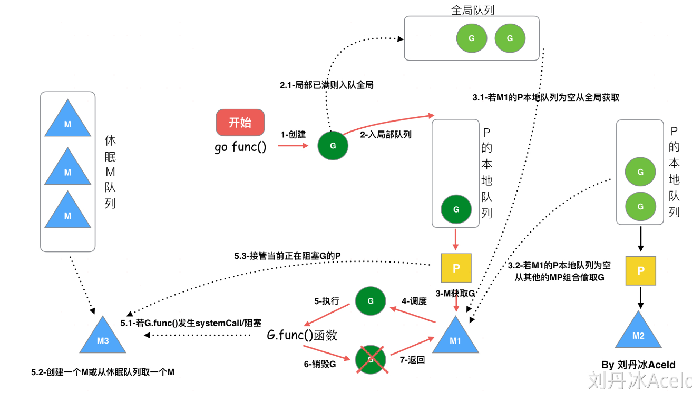
从上图我们可以分析出几个结论：
1. 我们通过 go func()来创建一个goroutine；
2. 有两个存储G的队列，一个是局部调度器P的本地队列、一个是全局G队列。新创建的G会先保存在P的本地队列中，如果P的本地队列已经满了就会保存在全局的队列中；
3. G只能运行在M中，一个M必须持有一个P，M与P是1：1的关系。M会从P的本地队列弹出一个可执行状态的G来执行，如果P的本地队列为空，就会想其他的MP组合偷取一个可执行的G来执行；
4. 一个M调度G执行的过程是一个循环机制；
5. 当M执行某一个G时候如果发生了syscall或则其余阻塞操作，M会阻塞，如果当前有一些G在执行，runtime会把这个线程M从P中摘除(detach)，然后再创建一个新的操作系统的线程(如果有空闲的线程可用就复用空闲线程)来服务于这个P；
6. 当M系统调用结束时候，这个G会尝试获取一个空闲的P执行，并放入到这个P的本地队列。如果获取不到P，那么这个线程M变成休眠状态， 加入到空闲线程中，然后这个G会被放入全局队列中。

### 调度器的生命周期
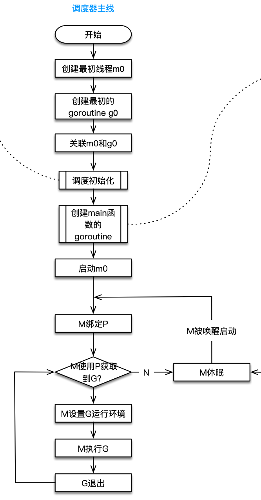
我们来跟踪一段代码
```go
package main

import "fmt"

func main() {
    fmt.Println("Hello world")
}
```
接下来我们来针对上面的代码对调度器里面的结构做一个分析

也会经历如上图所示的过程：
1. `runtime`创建最初的线程`m0`和`goroutine g0`，并把两者关联。
2. 调度器初始化：初始化m0、栈、垃圾回收，以及创建和初始化由`GOMAXPROCS`个P构成的P列表。
3. 示例代码中的main函数是`main.main`，`runtime`中也有1个`main`函数——`runtime.main`，代码经过编译后，`runtime.main`会调用`main.main`，程序启动时会为`runtime.main`创建`goroutine`，称它为`main goroutine`吧，然后把`main goroutine`加入到P的本地队列。
4. 启动m0，m0已经绑定了P，会从P的本地队列获取G，获取到`main goroutine`。
5. G拥有栈，M根据G中的栈信息和调度信息设置运行环境
6. M运行G
7. G退出，再次回到M获取可运行的G，这样重复下去，直到`main.main`退出，`runtime.main`执行`Defer`和`Panic`处理，或调用`runtime.exit`退出程序。

### GMP的可视化感受
参考资料：https://cloud.tencent.com/developer/article/1416864
上面的两个宏观角度，都是根据文档、代码整理出来，最后我们从可视化角度感受下调度器，有2种方式。
**方式1：go tool trace**
trace记录了运行时的信息，能提供可视化的Web页面。
简单测试代码：main函数创建trace，trace会运行在单独的goroutine中，然后main打印"Hello trace"退出。
```go
func main() {
    // 创建trace文件
    f, err := os.Create("trace.out")
    if err != nil {
        panic(err)
    }
    defer f.Close()

    // 启动trace goroutine
    err = trace.Start(f)
    if err != nil {
        panic(err)
    }
    defer trace.Stop()

    // main
    fmt.Println("Hello trace")
}
```
运行程序和运行trace：
```go
➜ go run trace1.go
Hello trace
➜ ls
trace.out trace1.go
➜ go tool trace trace.out
2019/03/24 20:48:22 Parsing trace...
2019/03/24 20:48:22 Splitting trace...
2019/03/24 20:48:22 Opening browser. Trace viewer is listening on http://127.0.0.1:55984
```
效果
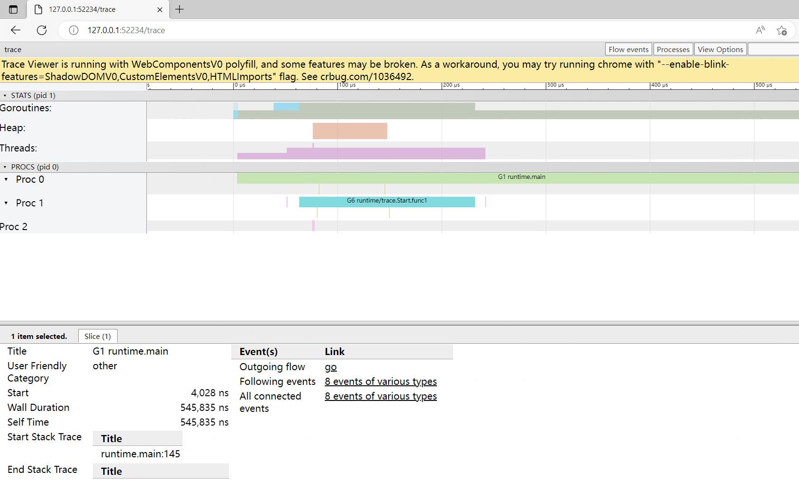
从上至下分别是goroutine（G）、堆、线程（M）、Proc（P）的信息，从左到右是时间线。用鼠标点击颜色块，最下面会列出详细的信息。

我们可以发现：
* runtime.main的goroutine是g1，这个编号应该永远都不变的，runtime.main是在g0之后创建的第一个goroutine。
* g1中调用了main.main，创建了trace goroutine g18。g1运行在P2上，g18运行在P0上。
* P1上实际上也有goroutine运行，可以看到短暂的竖线。

go tool trace的资料并不多，如果感兴趣可阅读：https://making.pusher.com/go-tool-trace/ ，中文翻译是：https://mp.weixin.qq.com/s/nf_-AH_LeBN3913Pt6CzQQ 。

**方式2：Debug trace**


### Go调度器常见调度场景分析
#### 场景一
P拥有G1，M1获取P后开始运行G1，G1使用go func()创建了G2，为了局部性G2优先加入到P1的本地队列。
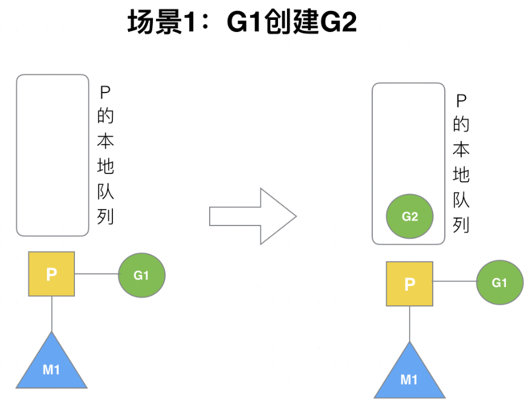
#### 场景二
G1运行完成后(函数：`goexit`)，M上运行的goroutine切换为G0，G0负责调度时协程的切换（函数：`schedule`）。从P的本地队列取G2，从G0切换到G2，并开始运行G2(函数：`execute`)。实现了线程M1的复用。
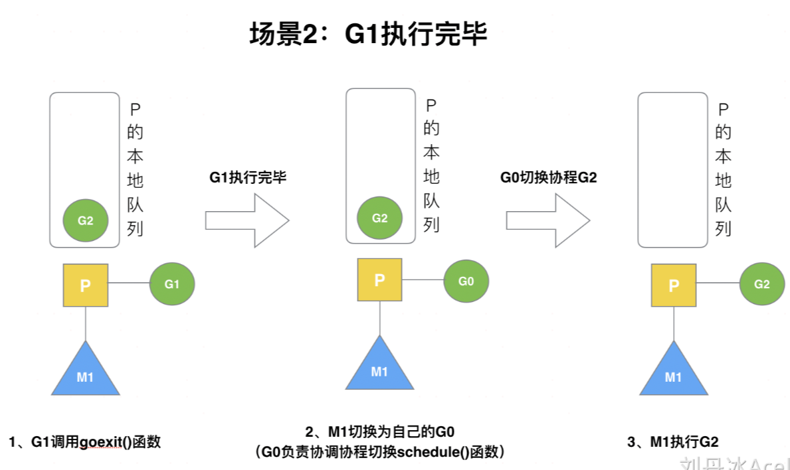
#### 场景三
假设每个P的本地队列只能存4个G。G2要创建了6个G，前4个G（G3, G4, G5, G6）已经加入p1的本地队列，p1本地队列满了。
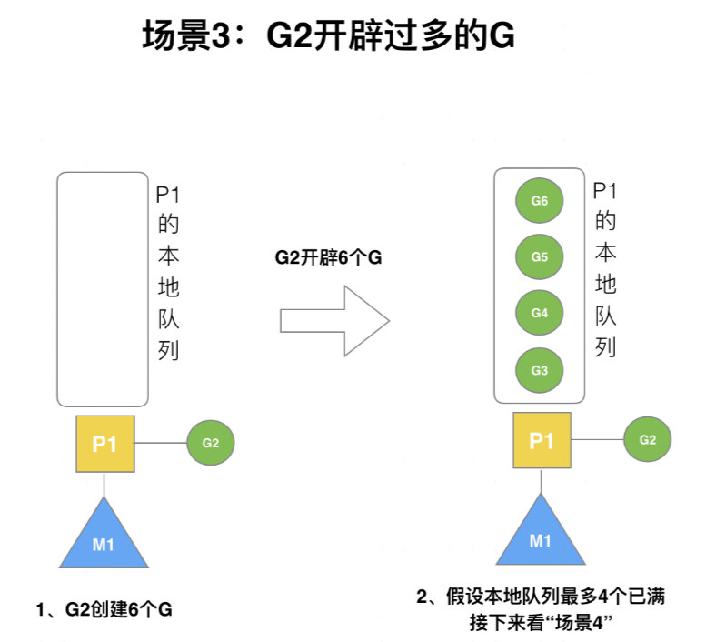
#### 场景四
G2在创建G7的时候，发现P1的本地队列已满，需要执行负载均衡(把P1中本地队列中前一半的G，还有新创建G转移到全局队列);这些G被转移到全局队列时，会被打乱顺序。所以G3,G4,G7被转移到全局队列。
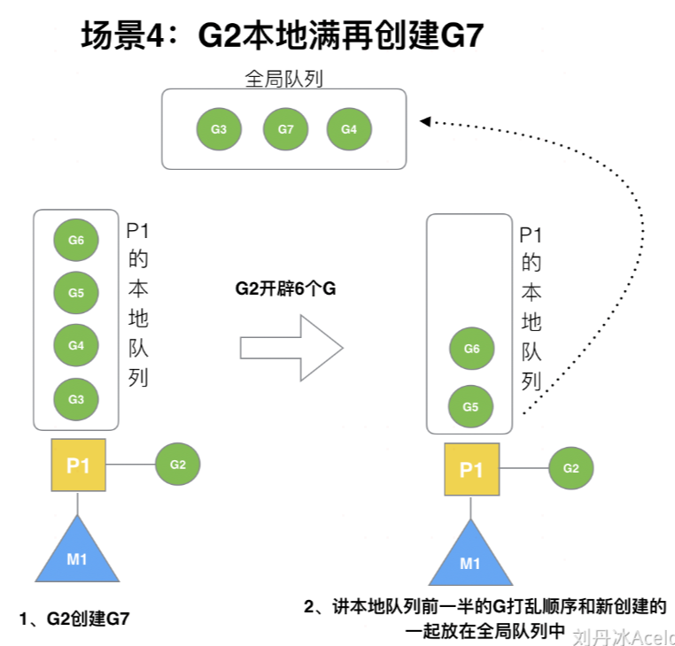
#### 场景五
G2创建G8时，P1的本地队列未满，所以G8会被加入到P1的本地队列。 G8加入到P1点本地队列的原因还是因为P1此时在与M1绑定，而G2此时是M1在执行。所以G2创建的新的G会优先放置到自己的M绑定的P上。
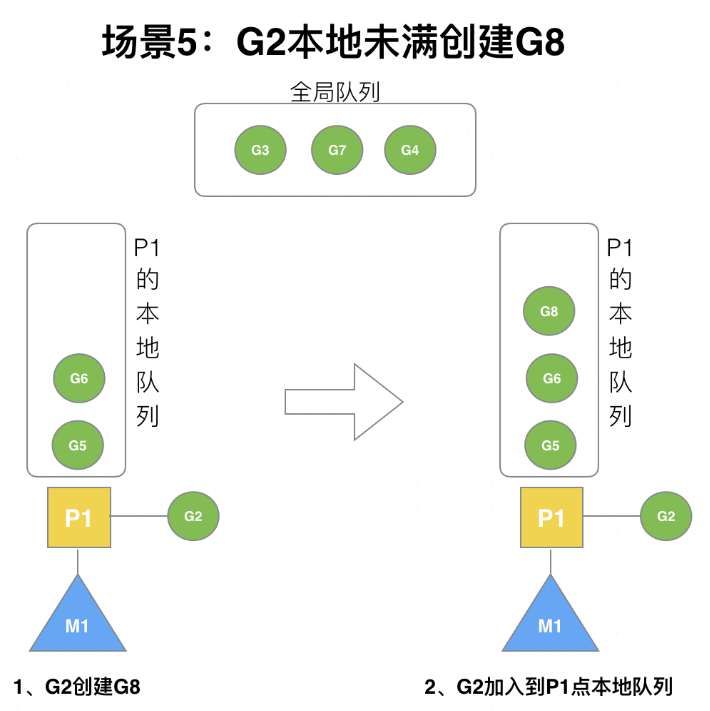
#### 场景六
规定：在创建G时，运行的G会尝试唤醒其他空闲的P和M组合去执行。假定G2唤醒了M2，M2绑定了P2，并运行G0，但P2本地队列没有G，M2此时为自旋线程（没有G但为运行状态的线程，不断寻找G）。
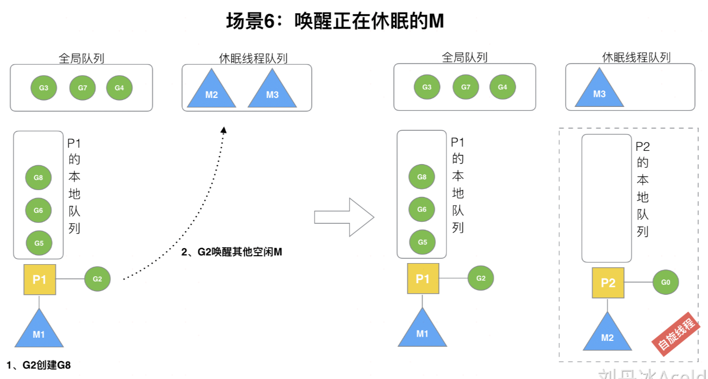
#### 场景七
M2尝试从全局队列(简称“GQ”)取一批G放到P2的本地队列（函数：findrunnable()）。M2从全局队列取的G数量符合下面的公式：
```go
n =  min(len(GQ) / GOMAXPROCS +  1,  cap(LQ) / 2 )
```
相关源码参考
```go
// 从全局队列中偷取，调用时必须锁住调度器
func globrunqget(_p_ *p, max int32) *g {
	// 如果全局队列中没有 g 直接返回
	if sched.runqsize == 0 {
		return nil
	}

	// per-P 的部分，如果只有一个 P 的全部取
	n := sched.runqsize/gomaxprocs + 1
	if n > sched.runqsize {
		n = sched.runqsize
	}

	// 不能超过取的最大个数
	if max > 0 && n > max {
		n = max
	}

	// 计算能不能在本地队列中放下 n 个
	if n > int32(len(_p_.runq))/2 {
		n = int32(len(_p_.runq)) / 2
	}

	// 修改本地队列的剩余空间
	sched.runqsize -= n
	// 拿到全局队列队头 g
	gp := sched.runq.pop()
	// 计数
	n--

	// 继续取剩下的 n-1 个全局队列放入本地队列
	for ; n > 0; n-- {
		gp1 := sched.runq.pop()
		runqput(_p_, gp1, false)
	}
	return gp
}
```
至少从全局队列取1个g，但每次不要从全局队列移动太多的g到p本地队列，给其他p留点。这是从全局队列到P本地队列的负载均衡。
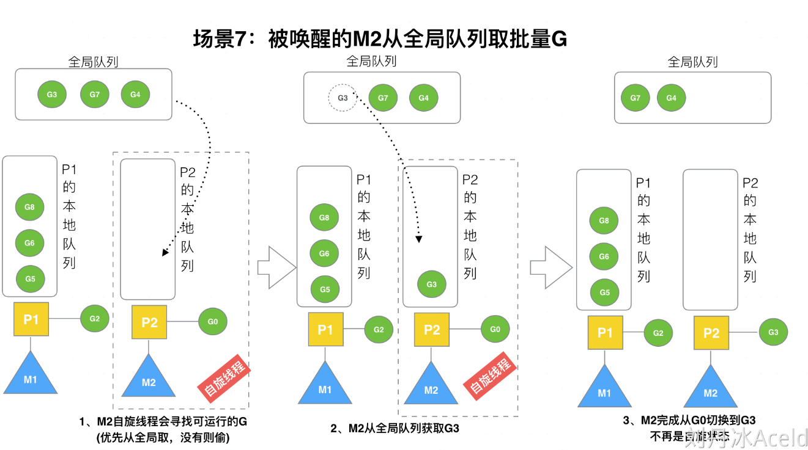
假定我们场景中一共有4个P（GOMAXPROCS设置为4，那么我们允许最多就能用4个P来供M使用）。所以M2只从能从全局队列取1个G（即G3）移动P2本地队列，然后完成从G0到G3的切换，运行G3。
#### 场景八
假设G2一直在M1上运行，经过2轮后，M2已经把G7、G4从全局队列获取到了P2的本地队列并完成运行，全局队列和P2的本地队列都空了,如图的左半部分。
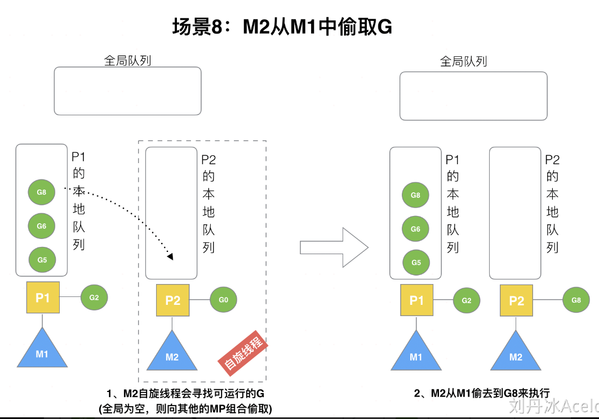
全局队列已经没有G，那m就要执行work stealing(偷取)：从其他有G的P哪里偷取一半G过来，放到自己的P本地队列。P2从P1的本地队列尾部取一半的G，本例中一半则只有1个G8，放到P2的本地队列并执行。
#### 场景九
G1本地队列G5、G6已经被其他M偷走并运行完成，当前M1和M2分别在运行G2和G8，M3和M4没有goroutine可以运行，M3和M4处于自旋状态，它们不断寻找goroutine。
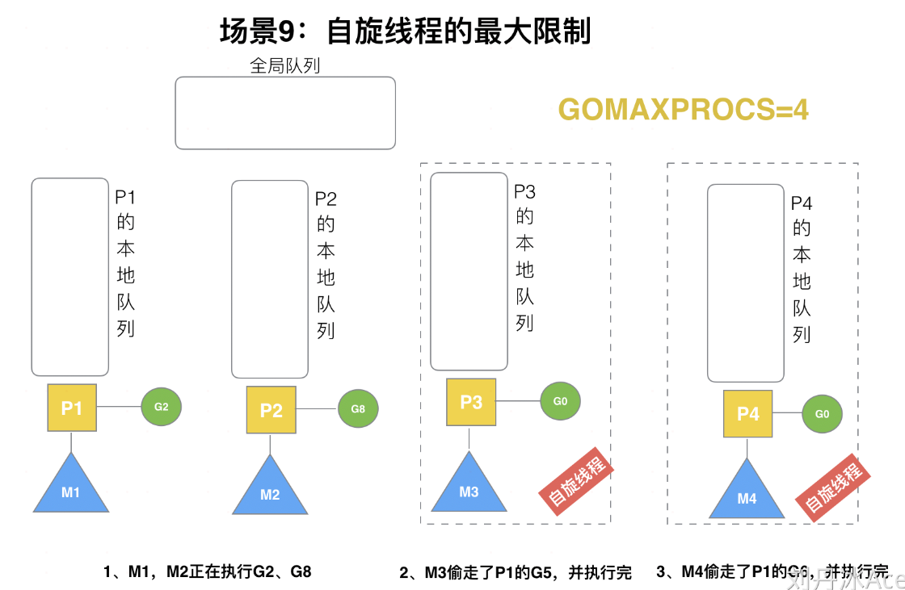
为什么要让m3和m4自旋，自旋本质是在运行，线程在运行却没有执行G，就变成了浪费CPU.  为什么不销毁现场，来节约CPU资源。因为创建和销毁CPU也会浪费时间，我们希望当有新goroutine创建时，立刻能有M运行它，如果销毁再新建就增加了时延，降低了效率。当然也考虑了过多的自旋线程是浪费CPU，所以系统中最多有GOMAXPROCS个自旋的线程(当前例子中的GOMAXPROCS=4，所以一共4个P)，多余的没事做线程会让他们休眠。
#### 场景十
假定当前除了M3和M4为自旋线程，还有M5和M6为空闲的线程(没有得到P的绑定，注意我们这里最多就只能够存在4个P，所以P的数量应该永远是M>=P, 大部分都是M在抢占需要运行的P)，G8创建了G9，G8进行了阻塞的系统调用，M2和P2立即解绑，P2会执行以下判断：如果P2本地队列有G、全局队列有G或有空闲的M，P2都会立马唤醒1个M和它绑定，否则P2则会加入到空闲P列表，等待M来获取可用的p。本场景中，P2本地队列有G9，可以和其他空闲的线程M5绑定。
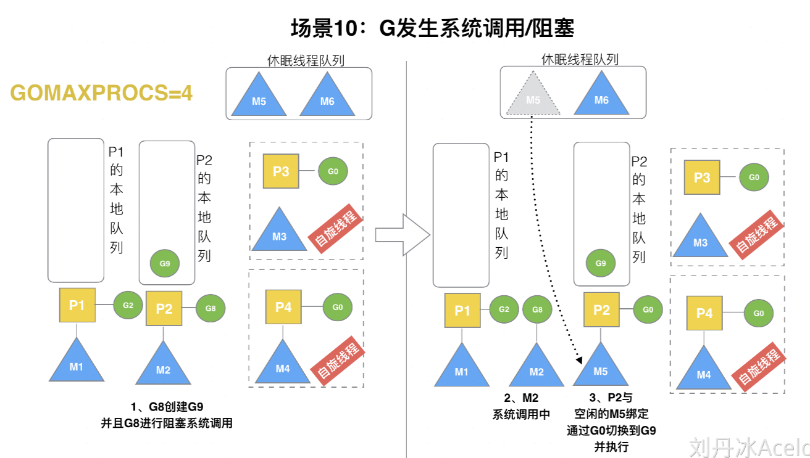
#### 场景十一
G8创建了G9，假如G8进行了非阻塞系统调用。
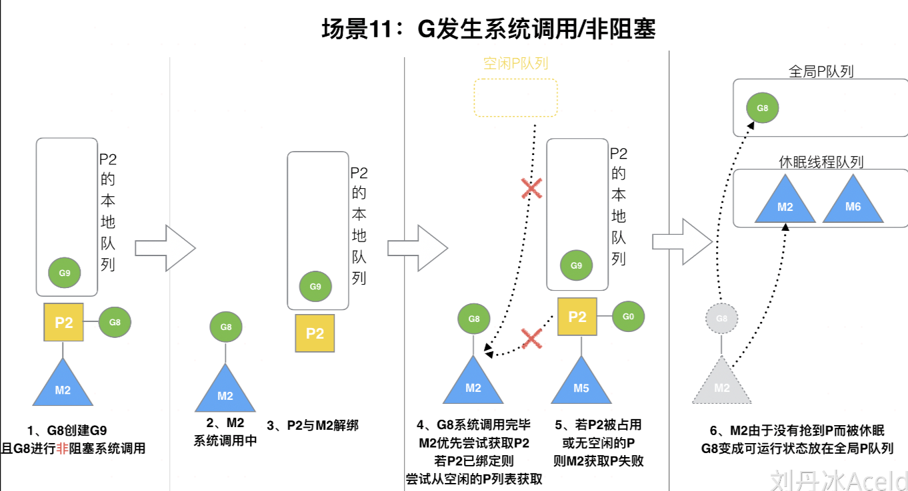


